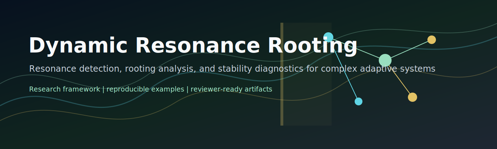
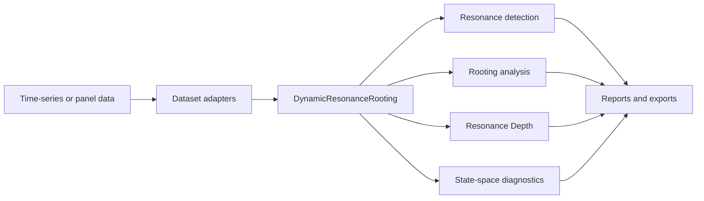

# Dynamic Resonance Rooting (DRR)



[](LICENSE)
[](https://github.com/topherchris420/dynamic-resonance-rooting/actions/workflows/python-app.yml)
[](pyproject.toml)
[](docs/reproducibility.md)

Dynamic Resonance Rooting is a research framework for studying complex adaptive
systems through resonance detection, directed rooting analysis, and normalized
resonance-depth diagnostics. It is designed for researchers, AI engineers,
complex systems scientists, model-risk reviewers, and collaborators who need a
reproducible computational surface for exploring oscillatory structure,
lead-lag relationships, stability, and validation-readiness artifacts.

Reference implementation for the research program **Dynamic Resonance Rooting: A
Computational Framework for Complex Adaptive Systems** by Christopher Woodyard.

## Project Overview

DRR analyzes time-series and panel systems by asking three connected questions:

1. Which oscillatory modes are present and persistent?
2. Which variables appear to lead or respond to other variables under lagged
   diagnostic scoring?
3. How stable, coherent, and reviewable is the detected resonance structure?

The package includes core analysis modules, deterministic synthetic examples,
state-space diagnostics, audience-specific reporting, supervisory review
artifacts, and a compact reproducibility harness.

## Motivation

Complex adaptive systems often show structure before they show simple linear
explanation. Oscillatory modes, lagged coupling, recurrent stress patterns, and
state-transition behavior can be useful diagnostics for scientific review. DRR
provides a single research surface for exploring those patterns while preserving
explicit caveats: the framework reports diagnostic evidence, not causal proof or
validated operational decisions.

## Key Concepts

- **Resonance detection:** identifies dominant spectral modes using FFT, Welch
  power spectral density, or Markov-state persistence.
- **Rooting analysis:** estimates directed lead-lag structure between variables
  using deterministic lagged correlation or transfer entropy when `pyinform` is
  available.
- **Resonance Depth:** a normalized composite score built from spectral
  concentration, temporal persistence, phase coherence, and amplitude stability.
- **State-space diagnostics:** Python-native transition, measurement, Kalman,
  likelihood, stability, and impulse-response summaries.
- **Validation readiness:** model-risk cards, caveated reports, event backtests,
  shadow-mode logs, and explainability summaries for reviewer workflows.

## Features

- FFT and Welch resonance detection with confidence and spectrum metadata.
- Composite Resonance Depth with component-level output and confidence interval.
- Lag-aware rooting analysis with surrogate p-values and significant-edge
  records.
- Synthetic coupled-oscillator reproduction harness with known frequency and
  directed edge.
- Benchmark generators for Lorenz, Roessler, Heston, and FitzHugh-Nagumo style
  workflows.
- Real-time sliding-window analyzer for streaming experiments.
- DSGE-inspired state-space diagnostics without Julia dependencies.
- Physics, policy, and supervisory analytics examples.
- Markdown, JSON, and Tableau-ready CSV exports.
- CI, pre-commit configuration, tests, reproducibility docs, and community files.

## Architecture Overview



More diagrams are available in [docs/architecture.md](docs/architecture.md),
including the data pipeline, resonance detection process, rooting analysis,
phase-transition review pattern, and package architecture.

## Installation

```bash
git clone https://github.com/topherchris420/dynamic-resonance-rooting.git
cd dynamic-resonance-rooting
python -m pip install -e .
```

For contributors:

```bash
python -m pip install -e ".[dev]"
pre-commit install
```

## Quick Start

```python
from drr_framework import DynamicResonanceRooting, generate_coupled_oscillator

sampling_rate = 200.0
_, data = generate_coupled_oscillator(
    sampling_rate=sampling_rate,
    target_frequency_hz=12.5,
    lag=2,
    random_state=42,
)

drr = DynamicResonanceRooting(embedding_dim=3, tau=2, sampling_rate=sampling_rate)
results = drr.analyze_system(data, multivariate=True, window_size=256)

print(results["resonance_depths"])
print(results["rooting_analysis"]["significant_edges"])
```

Run the end-to-end quickstart example:

```bash
python examples/quickstart_resonance_export.py
```

This loads `data/raw/coupled_oscillator_sample.csv`, computes resonance metrics,
writes JSON/CSV summaries, and saves a trace figure under `results/quickstart/`.

## Example Outputs

The deterministic quickstart and reproduction harness currently report:

```text
detected_frequency_hz: 12.5
frequency_error_hz: 0.0
resonance_depth: 0.9042969836929234
rooting_method: lagged_correlation
expected_edge: dim_0 -> dim_1
expected_lag_samples: 2
```

Reference artifacts:

- [results/reproduction/drr_reproduction_summary.json](results/reproduction/drr_reproduction_summary.json)
- [results/reproduction/drr_reproduction_metrics.csv](results/reproduction/drr_reproduction_metrics.csv)
- [results/expected/quickstart_expected_summary.json](results/expected/quickstart_expected_summary.json)

Regenerate the reproduction benchmark:

```bash
python -m drr_framework.experiments --output-dir results/reproduction
```

## Repository Structure

```text
src/drr_framework/       Core Python package
examples/                Runnable physics, policy, supervisory, and quickstart demos
tests/                   Unit and workflow tests
docs/                    Architecture, API, user, developer, FAQ, and reproducibility docs
data/raw/                Small committed example datasets
data/processed/          Small deterministic processed artifacts
results/expected/        Expected output references
notebooks/               Tutorial notebooks and archived notebook material
assets/                  Hero image and web-demo assets
paper/                   Paper/supplement scaffold and historical prototype fragment
.github/                 CI, issue templates, and PR template
```

## Scientific Background

DRR sits at the intersection of nonlinear dynamics, spectral analysis,
information-theoretic influence diagnostics, state-space modeling, and
scientific software reproducibility. The framework is intentionally conservative
about interpretation. Resonance and rooting outputs can guide review, hypothesis
generation, monitoring design, and experiment planning, but domain conclusions
require independent validation against the target system.

For domain-specific caveats, see:

- [docs/audience-guide.md](docs/audience-guide.md)
- [docs/method-crosswalk.md](docs/method-crosswalk.md)
- [docs/validation-readiness-guide.md](docs/validation-readiness-guide.md)

## Documentation

- [Architecture](docs/architecture.md)
- [API documentation](docs/api.md)
- [User guide](docs/user-guide.md)
- [Developer guide](docs/developer-guide.md)
- [Examples](docs/examples.md)
- [Reproducibility guide](docs/reproducibility.md)
- [FAQ](docs/faq.md)

## Roadmap

- Expand controlled synthetic benchmarks across noise, lag, and regime-shift
  scenarios.
- Add rolling-window phase-transition review examples with expected outputs.
- Add richer notebook narratives for physics, policy, and supervisory audiences.
- Harden optional transfer-entropy workflows across environments.
- Publish a paper supplement with method notation, assumptions, and validation
  boundaries.
- Continue improving API typing, docs coverage, and reviewer-facing reports.

## Citation

See [CITATION.cff](CITATION.cff). If you use this software in research, cite the
software artifact and the associated DRR paper or manuscript when available.

```bibtex
@software{woodyard_drr_framework_2026,
  author = {Woodyard, Christopher},
  title = {Dynamic Resonance Rooting Framework},
  year = {2026},
  url = {https://github.com/topherchris420/dynamic-resonance-rooting},
  license = {MIT},
  note = {Research software for resonance, rooting, and stability diagnostics in complex adaptive systems}
}
```

## License

This repository is released under the [MIT License](LICENSE).

## Contributing

Contributions are welcome when they preserve the research voice, include tests
for behavior changes, and avoid unsupported claims. Start with
[CONTRIBUTING.md](CONTRIBUTING.md), [CODE_OF_CONDUCT.md](CODE_OF_CONDUCT.md),
and [SECURITY.md](SECURITY.md).

Suggested GitHub topics for discoverability:

```text
complex-adaptive-systems, resonance-detection, nonlinear-dynamics,
state-space-models, transfer-entropy, scientific-computing,
reproducible-research, model-risk, ai-safety, complex-systems
```

## Acknowledgements

DRR reflects Christopher Woodyard's research direction and framework design. The
repository also builds on the open scientific Python ecosystem, including NumPy,
SciPy, pandas, scikit-learn, NetworkX, matplotlib, and related tooling.

## Review Boundary

This is a research implementation. Clinical, financial, defense,
infrastructure, or supervisory use requires independent validation, calibration,
governance approval, and domain-specific risk review.
