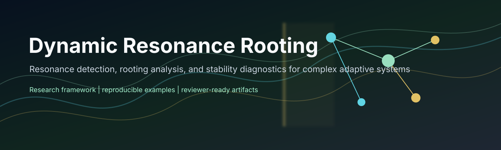

# Dynamic Resonance Rooting



[](https://github.com/topherchris420/dynamic-resonance-rooting/actions/workflows/python-app.yml)
[](pyproject.toml)
[](LICENSE)

**Measure the rhythm. Trace the lag. Keep the evidence.**

Dynamic Resonance Rooting (DRR) is an open-source Python research framework for multivariate time series. It looks for oscillatory structure, estimates lagged relationships between signals, measures the persistence of those patterns, and helps you test whether an apparent change survives a challenge. Physics, sensing, financial research, and supervisory analysis use the same core operators through separate workflows.

The outputs are **diagnostics**. A directed edge is a statistical lead–lag relationship under a chosen estimator and null model; it does not establish causation. A result in one domain does not validate another. DRR is developed by [Christopher Woodyard](https://github.com/topherchris420) at [Vers3Dynamics](https://vers3dynamics.com).

**Start here:** [Run the synthetic example](#quick-start) · [Inspect the external result](#what-the-evidence-says) · [Choose a workflow](#choose-a-workflow) · [Read the architecture](docs/architecture.md)

## What it does

| Question | DRR component | What you get |
| --- | --- | --- |
| Which rhythms recur, and for how long? | FFT, Welch, wavelet, and resonance-depth operators | Frequencies, spectral power, and depth components |
| Which signal tends to lead another? | Lagged correlation or transfer entropy with surrogate testing | Candidate edges, tested edges, lags, and p-values |
| Has the system's structure shifted? | State-space, topology, and structural-surprise diagnostics | Estimated states, changes, and uncertainty to investigate |
| Can a bounded input change a simulated state? | Navigation engine and matched control experiments | Proposed interventions and comparison metrics for a modeled system |

The core operates on a numeric series. The **validation substrate** includes synthetic ground truth, specification and leakage tests, surrogate inference, and a preregistered external comparison. **Domain adapters** prepare and interpret data for their own settings. See the [architecture and claim boundaries](docs/architecture.md).

## Quick start

Use Python 3.8 or newer. For a checkout of the current code:

```bash
git clone https://github.com/topherchris420/dynamic-resonance-rooting.git
cd dynamic-resonance-rooting
python -m pip install -e .
```

This example generates three synthetic channels: a 12.5 Hz source, a copy delayed by two samples, and an independent distractor. It then runs the spectral, depth, and rooting operators. The random seeds make the example repeatable.

```python
from drr_framework import DynamicResonanceRooting, generate_coupled_oscillator

_, data = generate_coupled_oscillator(random_state=42)
result = DynamicResonanceRooting(tau=2, sampling_rate=200).analyze_system(
    data,
    multivariate=True,
    window_size=256,
    state_space=False,
    rooting_max_lag=4,
    rooting_n_surrogates=25,
    rooting_random_state=42,
)

print(result["resonances"]["dim_0"]["dominant_freq"])
print(result["resonance_depths"])
for edge in result["rooting_analysis"]["significant_edges"]:
    print(edge["source"], "→", edge["target"], "lag:", edge["lag"])
```

On the checked synthetic fixture, the selected edge is `dim_0 → dim_1` at lag `2`. `candidate_edges` are exploratory; `significant_edges` pass the selected surrogate test and correction. With 25 surrogates, the smallest attainable p-value is `1/26 ≈ 0.0385`. The default rooting estimator is **lagged correlation**, even though the result retains a legacy `transfer_entropy` matrix alias. Request `rooting_method="transfer_entropy"` explicitly if you want that estimator, and inspect the returned `method` for the effective backend. [Reproducibility details](docs/reproducibility.md).

For the packaged, deterministic benchmark without writing output files:

```bash
drr-reproduce --no-artifacts
```

Or run the complete example and write JSON/CSV artifacts to a directory you choose:

```bash
drr-reproduce --output-dir results/reproduction
```

## What the evidence says

The synthetic oscillator checks whether the implementation recovers **known, injected** frequency and lag. It is a specification check, not evidence of general predictive performance.

The repository also contains a [preregistered external comparison](docs/external-evidence.md) on the NOAA CPC quasi-biennial oscillation series. Its reviewed [machine-readable artifact](results/expected/qbo_structural_change_benchmark.json) reports **`claim.status: not_supported`**: full DRR exceeded the prespecified 5% false-alarm tolerance on quiet holdout months. It missed the 2016 disruption window and flagged the 2019–2020 window. The study's result applies to that atmospheric comparison; it neither validates nor invalidates applications in finance, supervision, sensing, or physics.

To reproduce that comparison from the vendored public-data snapshots:

```bash
python scripts/run_structural_change_benchmark.py --output-dir results/expected
```

The [protocol](src/drr_framework/external_benchmark/data/preregistration.json) fixes the dataset checksums, disruption windows, holdout, baselines, ablations, tolerance, and decision rule. The [readable report](results/expected/qbo_structural_change_benchmark.md) accompanies the JSON. Historical narrative tables in [DRR_BENCHMARKS.md](DRR_BENCHMARKS.md) are separate from this preregistered result.

## Choose a workflow

| If you're exploring… | Start with | Details |
| --- | --- | --- |
| Oscillators and nonlinear systems | `python examples/physics_lab.py` | [Physics and methods](docs/audience-guide.md) |
| Sensing and micro-Doppler analog signals | `python examples/sensing_systems_resonance_depth.py` | [Examples](docs/examples.md) |
| State estimation and filtering | `python examples/state_space_lab.py` | [API reference](docs/api.md) |
| Macroeconomic and market research | `python examples/quant_macro_lab.py --offline` | [Quant research guide](docs/quant-research.md) |
| Public-data supervisory monitoring | `drr-monitor --demo` | [LFBO workbench](docs/lfbo-workbench.md) |
| Multiple perspectives on the same system | `DRR_ScopeResolver` | [Scope resolution](docs/scope-resolution.md) |

The LFBO demo uses **synthetic** observations and exports a local review artifact. Use `drr-monitor --demo --serve` to open its loopback-only review interface. The workbench reconstructs data vintages, reconciles exceptions, compares peers, and records evidence and analyst dispositions. Its optional [typed judgment overlay](docs/typed-judgment.md) is disabled by default; when enabled, it cannot change the measurements, hashes, or attention rank. These are research tools, not supervisory findings or approvals.

The scope resolver keeps conflicting observations attributable to their source and scale. It does not decide which observation is true. For the underlying data contracts and caveats, see the [LFBO guide](docs/lfbo-workbench.md) and [scope guide](docs/scope-resolution.md).

## Installation and development

The base package is `drr-framework`. Optional integrations can be installed separately:

| Extra | Purpose |
| --- | --- |
| `quant-data`, `quant-risk`, `quant-ml`, `quant-validation` | OpenBB, Riskfolio-Lib, Qlib, and VectorBT adapters |
| `quant` | All four quantitative research adapters |
| `judgment` | Optional TypeSafe provider for the workbench (Python 3.10+) |
| `econometrics`, `contingency` | Supplementary statistical and binary metrology workflows |
| `dev` | Formatting, linting, and test tools |

For example: `python -m pip install -e ".[dev]"`. Read [pyproject.toml](pyproject.toml) for exact dependencies and Python version markers. To run the project checks:

```bash
python -m pip install -e ".[dev]"
python -m pytest
python -m ruff check .
python -m black --check .
```

## Reading map

- [User guide](docs/user-guide.md) and [API reference](docs/api.md) for the core.
- [Architecture](docs/architecture.md) and [method crosswalk](docs/method-crosswalk.md) for design and conventional comparators.
- [External evidence](docs/external-evidence.md) and [reproducibility](docs/reproducibility.md) for claim scope and reproduction.
- [Quant research](docs/quant-research.md), [LFBO workbench](docs/lfbo-workbench.md), and [validation readiness](docs/validation-readiness-guide.md) for domain workflows.
- [Security posture](docs/security-posture.md) and [developer guide](docs/developer-guide.md) for operation and contributions.

## Cite and contribute

Please use [CITATION.cff](CITATION.cff) when citing the software. Contributions that sharpen a definition, add a falsifiable baseline, expose a failure mode, or make a result easier to reproduce are welcome; see the [developer guide](docs/developer-guide.md).

Copyright © Christopher Woodyard. Released under the [MIT License](LICENSE).
