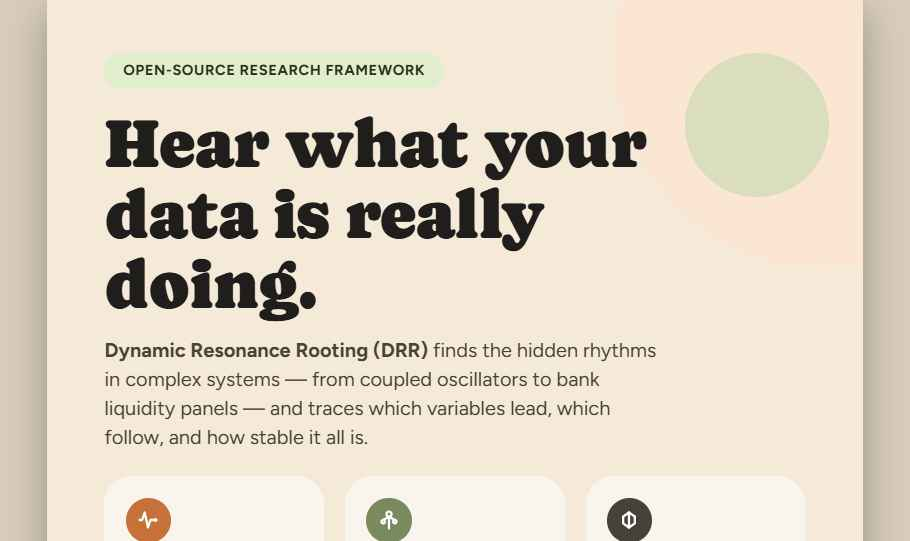

# Dynamic Resonance Rooting (DRR) Framework

[](https://github.com/topherchris420/dynamic-resonance-rooting/actions/workflows/python-app.yml)
[](https://opensource.org/licenses/MIT)

A research framework for studying complex adaptive systems through resonance detection, causal rooting analysis, and stability diagnostics.

**Version:** 4.3.0  
**License:** MIT  
**Author:** Christopher Woodyard

---

## 📄 Flier

A one-page overview of DRR — what it detects, who it's for, and how to get started.

<p align="center">
  <a href="docs/assets/drr-flier.png">
    
  </a>
</p>

Print-ready (US Letter). Learn more at [Vers3Dynamics.com](https://vers3dynamics.com).

---

## What is DRR?

The **Dynamic Resonance Rooting (DRR) Framework** is a computational pipeline that analyzes time-series and panel data to answer three core questions about complex adaptive systems:

1. **Resonance Detection** — What oscillatory modes exist in the data?
2. **Rooting Analysis** — What are the directional lead-lag relationships between variables?
3. **Stability Assessment** — How stable are the resonance structures over time?

DRR combines spectral analysis (FFT, Welch PSD, Morlet wavelet scalograms), causal rooting (transfer entropy, lagged correlation), and state-space diagnostics to provide evidence for hypothesis generation about system behavior.

---

## Key Features

### Core Capabilities

| Capability | Description |
|------------|-------------|
| **Resonance Detection** | Identifies oscillatory patterns via FFT, Welch power spectral density, or Morlet wavelet scalograms (time-localized, for nonstationary signals) |
| **Causal Rooting** | Maps directional lead-lag relationships using transfer entropy or lagged correlation |
| **Resonance Depth** | Composite scoring combining spectral concentration, temporal persistence, phase coherence, and amplitude stability |
| **State-Space Diagnostics** | Transition, measurement, and stability analysis with a Kalman filter |
| **State-Space Smoothing** | Retrospective states and structural shocks via Hamilton (RTS) and Koopman disturbance smoothers, plus Durbin–Koopman and Carter–Kohn posterior draws |
| **Nonlinear Filtering** | Tempered particle filter (Herbst–Schorfheide) for likelihood evaluation of nonlinear resonance systems, plus fast Chandrasekhar recursions for linear ones |
| **Phase-Transition Detection** | Evidence for drift or abrupt changes in system behavior |

### Supported Data Sources

| Source | Description |
|--------|-------------|
| **Physics Systems** | Coupled oscillators, Lorenz, Rössler, Heston, FitzHugh-Nagumo benchmarks |
| **Policy Data** | Tabular time-series from FRED, policy observables |
| **Supervisory Panels** | Banking data (FFIEC 002, FR Y-9C), institutional metrics |
| **Custom Time-Series** | Any multivariate numerical array |

### Export Formats

- **JSON** — Structured analysis results
- **CSV** — Tableau-ready artifacts
- **Markdown** — Human-readable reports
- **Plots** — Visualization of resonance, rooting graphs, state-space

---

## Installation

### From PyPI

```bash
pip install drr-framework
```

### From Source

```bash
git clone https://github.com/topherchris420/dynamic-resonance-rooting.git
cd dynamic-resonance-rooting
python -m pip install -e .
```

For development tools:

```bash
python -m pip install -e ".[dev]"
pre-commit install
```

---

## Quick Start

```python
from drr_framework import DynamicResonanceRooting, generate_coupled_oscillator

sampling_rate = 200.0
_, data = generate_coupled_oscillator(
    sampling_rate=sampling_rate,
    target_frequency_hz=12.5,
    random_state=42,
)

drr = DynamicResonanceRooting(embedding_dim=3, tau=2, sampling_rate=sampling_rate)
results = drr.analyze_system(data, multivariate=True, window_size=256)

print(results["resonance_depths"])
print(results["rooting_analysis"]["significant_edges"])
```

---

## Use Cases

### Sonoluminescence Lab
**File:** `examples/sonoluminescence_lab.py`

Multimodal coupled resonant system benchmark spanning acoustic, cavitation, optical, and electrical domains:
- Ultrasonic acoustic driver ($f_a \sim 25\text{ kHz}$)
- Acoustic waveguide horn resonator & impedance concentration
- Rayleigh-Plesset nonlinear bubble oscillator & Blake cavitation threshold
- Ultrafast UV-blue sonoluminescence flash emission ($\lambda_{EM} \sim 350\text{ nm}$)
- Downstream optical/electrical transduction & energy bookkeeping
- Resonant Transduction Efficiency Index (RTEI) metric

### Physics Lab
**File:** `examples/physics_lab.py`

Analyze coupled oscillator systems and benchmark generators:
- Lorenz attractor
- Rössler system
- Heston volatility model
- FitzHugh-Nagumo neurons

### Policy Lab
**File:** `examples/policy_lab.py`

Analyze tabular policy observables:
- Time-series from FRED
- Economic indicators
- Policy shock response

### Supervisory Policy Lab
**File:** `examples/supervisory_policy_lab.py`

Federal Reserve banking supervision:
- FFIEC 002 / FR Y-9C data integration
- Institutional risk metrics
- Validation-readiness packets
- **Tableau exports for executive dashboards**

### State-Space Lab
**File:** `examples/state_space_lab.py`

End-to-end state-space workflow — fit, Kalman filter, Koopman smooth (with
structural shocks), Durbin–Koopman posterior bands, Chandrasekhar likelihood,
and a tempered particle filter on a nonlinear observation.

### Quick Start
**File:** `examples/quickstart_resonance_export.py`

Compact load-detect-export demonstration

---

## Sonoluminescence / Resonant Transduction Benchmark

The framework includes a research-grade physical benchmark modeling multi-stage coupled energy transduction across distinct physical domains:

```
    Acoustic Excitation
           ↓
    Acoustic Resonator
           ↓
    Impedance Transformation
           ↓
    Cavitation
           ↓
    Bubble Collapse
           ↓
    Sonoluminescence
           ↓
    Optical/EM Coupling
           ↓
    Electrical Transduction
           ↓
    DRR Analysis
```

### Physical vs. Phenomenological Modeling Disclosures

| Domain | Governing Physics / Formulation | Status |
|--------|----------------------------------|--------|
| **Acoustic Driver** | Acoustic wave speed $c_s = 1482\text{ m/s}$, ultrasonic frequency $f_a \approx 25\text{ kHz}$, wavelength $\lambda_a = c_s / f_a \approx 5.93\text{ cm}$ | Physically motivated |
| **Acoustic Waveguide / Resonator** | Geometric area concentration $(d_{in}/d_{out})$, half-wave standing-wave cavity response with quality factor $Q$ and detuning $\delta$. *Waveguide is an acoustic impedance structure, not an electrical transformer.* | Idealized 1D acoustic approximation |
| **Bubble Cavitation Dynamics** | Modified Rayleigh-Plesset equation with van der Waals excluded volume core ($R_{core} \approx R_0 / 8.5$), liquid viscosity $\mu_L$, surface tension $\sigma$, and Blake cavitation threshold | Physically motivated |
| **Sonoluminescent Emission** | Ultrafast flash pulses ($\tau \sim 200\text{ ps}$) triggered during violent collapse rebounds ($R \to R_{min}$), optical center $\lambda_{EM} \approx 350\text{ nm}$ (UV-blue continuum), $f_{EM} = c / \lambda_{EM} \approx 8.57 \times 10^{14}\text{ Hz}$ | Phenomenological model |
| **Electrical Transduction** | Downstream photodetector responsivity, collection factor $\eta_{col}$, RC low-pass filter, and energy accounting | Downstream detector model |
| **DRR Metrics (RTEI)** | Resonant Transduction Efficiency Index quantifying multimodal coherence across the 8-channel time series | Proposed DRR research metric |

> [!IMPORTANT]
> **No Net Energy Amplification Claimed**: The benchmark explicitly accounts for total acoustic input energy versus electrical output energy ($E_{elec} / E_{acoustic} \ll 1$). The purpose is computational study of nonlinear resonance, modal concentration, phase coherence, and causal lead-lag rooting across multimodal physics.

### Benchmark Usage Example

```python
from drr_framework import (
    DynamicResonanceRooting,
    calculate_resonant_transduction_efficiency_index,
    generate_sonoluminescence_system,
)

# 1. Generate 8-channel multivariate acousto-opto-electrical benchmark
time, data, metadata = generate_sonoluminescence_system(
    sampling_rate=100_000,
    duration=0.002,
    acoustic_frequency_hz=25_000,
    input_pressure_pa=60_000,
    waveguide_input_diameter_m=0.020,
    waveguide_output_diameter_m=0.004,
    random_state=42,
)

# 2. Analyze multi-channel resonance and directed rooting with DRR
drr = DynamicResonanceRooting(sampling_rate=100_000)
results = drr.analyze_system(data, multivariate=True)

# 3. Compute the Resonant Transduction Efficiency Index (RTEI)
rtei = calculate_resonant_transduction_efficiency_index(results, metadata)
print(f"RTEI: {rtei['rtei']:.5f}")
```


---

## Macro Stability & Banking Skin Cockpit

The framework includes a specialized supervisory application for Federal Reserve oversight:

### Purpose
Real-time early-warning system for detecting non-linear liquidity panics ("Dash for Cash" loop) across Large Foreign Banking Organizations (LFBOs).

### Key Capabilities
1. **Resonance Detection** — Identifies hidden cyclical funding stress via Welch/FFT
2. **Rooting Analysis** — Maps lead-lag structures between Treasury shocks and bank liquidity drains
3. **Composite Scoring** — Resonance Depth combining spectral concentration, temporal persistence, phase coherence, amplitude stability
4. **Stress Simulation** — 200 bps parallel rate shift (Full AOCI vs. Opt-Out)

### Files
- `layer1_regulatory_backend.py` — Python/SQL regulatory backend
- `layer2_tableau_blueprint.twb` — Tableau dashboard blueprint
- `tableau_calculated_fields.py` — Tableau calculated fields
- `tableau_output/` — Generated CSV exports

### Compliance
Implements **SR 11-7 Model Risk Management** guidelines from the Federal Reserve.

---

## Project Structure

```
dynamic-resonance-rooting/
├── src/drr_framework/          # Core package
│   ├── analysis.py             # DynamicResonanceRooting class
│   ├── _spectral.py            # Spectral analysis
│   ├── benchmarks.py           # Benchmark generators
│   ├── sonoluminescence.py     # Sonoluminescence & acousto-opto-electrical benchmark
│   ├── datasets.py              # Data adapters
│   ├── reporting.py            # Export utilities
│   ├── state_space.py          # State-space filter, Chandrasekhar recursions
│   ├── smoothers.py            # Kalman & simulation smoothers
│   ├── particle_filter.py      # Tempered particle filter (nonlinear)
│   ├── supervision.py           # Supervisory components
│   └── validation_readiness.py # Validation packets
├── examples/                    # Usage examples
│   ├── sonoluminescence_lab.py
│   ├── physics_lab.py
│   ├── policy_lab.py
│   ├── supervisory_policy_lab.py
│   └── quickstart_resonance_export.py
├── tests/                       # Test suite
│   ├── test_sonoluminescence.py

├── docs/                        # Documentation
│   ├── architecture.md
│   ├── user-guide.md
│   ├── developer-guide.md
│   ├── api.md
│   └── faq.md
├── data/                        # Datasets
├── results/                     # Output artifacts
└── pyproject.toml              # Package config
```

---

## Output Interpretation

| Key | Description |
|-----|-------------|
| `resonances` | Dominant frequencies and spectral evidence |
| `resonance_depths` | Scalar persistence/stability scores by dimension |
| `resonance_depth_details` | Component-level scores and confidence intervals |
| `rooting_analysis` | Directed lagged relationships and edge metadata |
| `state_space_analysis` | Transition, measurement, likelihood, stability, impulse-response |

**Important:** DRR outputs are research diagnostics. Domain conclusions require separate validation, calibration, and review.

---

## Documentation

- [User Guide](docs/user-guide.md) — Getting started
- [Architecture](docs/architecture.md) — System design
- [API Reference](docs/api.md) — Function documentation
- [Developer Guide](docs/developer-guide.md) — Contributing
- [FAQ](docs/faq.md) — Common questions
- [Reproducibility](docs/reproducibility.md) — Ensuring reproducible results
- [Validation Readiness](docs/validation-readiness-guide.md) — Model validation

---

## Citation

If you use DRR in your research, please cite:

```bibtex
@software{drr-framework,
  author = {Christopher Woodyard},
  title = {Dynamic Resonance Rooting (DRR) Framework},
  url = {https://github.com/topherchris420/dynamic-resonance-rooting},
  version = {4.3.0},
  year = {2026}
}
```

---

## License

MIT License — see LICENSE file for details.

---

## Acknowledgments

The state-space filtering and smoothing routines (`state_space.py`,
`smoothers.py`, `particle_filter.py`) are dependency-free NumPy ports of the
algorithms in the New York Fed's
[`StateSpaceRoutines.jl`](https://github.com/FRBNY-DSGE/StateSpaceRoutines.jl):
the Kalman filter and Chandrasekhar recursions, the Hamilton and Koopman
smoothers, the Durbin–Koopman and Carter–Kohn simulation smoothers, and the
tempered particle filter (Herbst & Schorfheide, 2019). DRR does not depend on
Julia; the ports let DRR use these methods natively in Python.

## References

- Herbst, E. & Schorfheide, F. (2019). *Tempered Particle Filtering.* Journal of Econometrics.
- Durbin, J. & Koopman, S. J. (2012). *Time Series Analysis by State Space Methods.*
- Herbst, E. (2015). *Using the "Chandrasekhar Recursions" for Likelihood Evaluation of DSGE Models.*
- [StateSpaceRoutines.jl](https://github.com/FRBNY-DSGE/StateSpaceRoutines.jl)
- [FFIEC 002 Reports](https://www.ffiec.gov/NPW)
- [Federal Reserve Supervision](https://www.federalreserve.gov/supervisionreg.htm)
- [SR 11-7: Model Risk Management](https://www.federalreserve.gov/supervisionreg/srletters/sr1107.htm)
