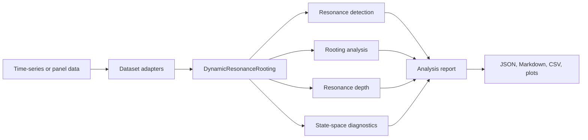
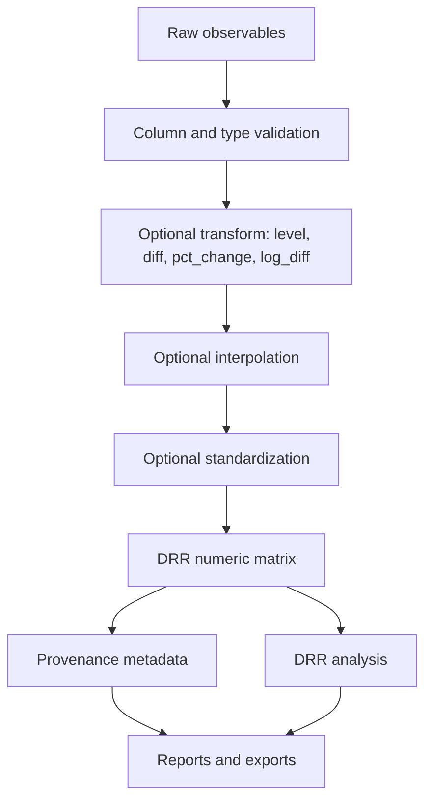
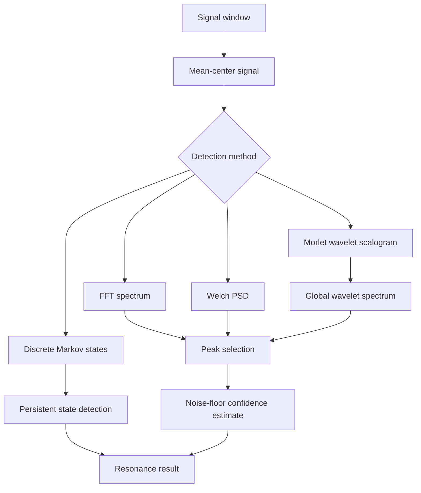
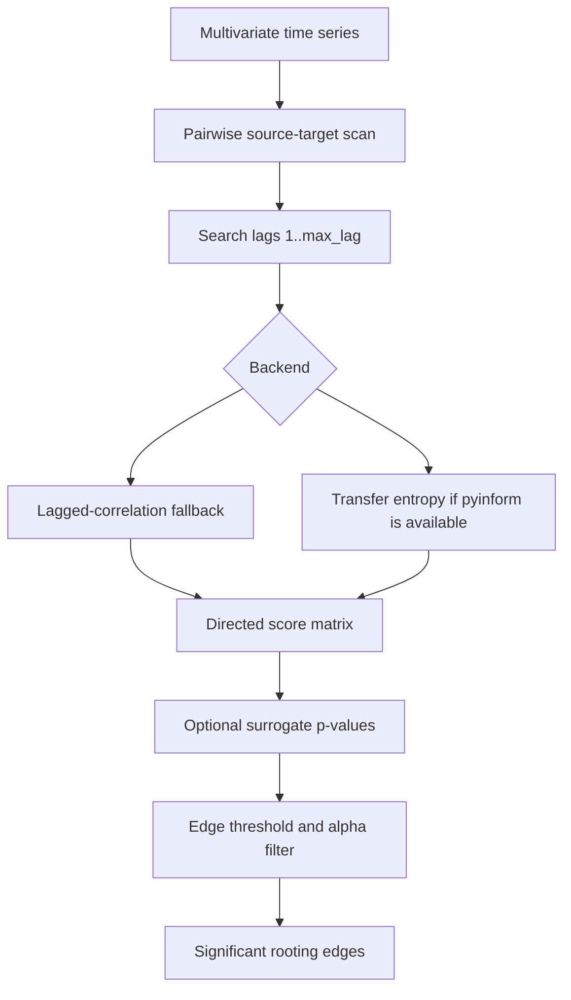
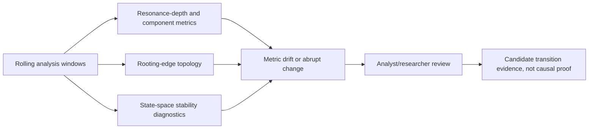
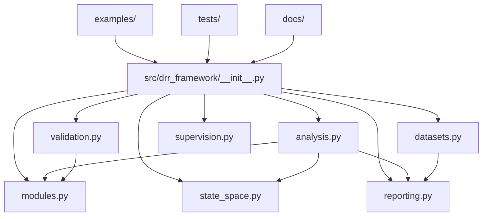

# Architecture

Dynamic Resonance Rooting (DRR) is organized as a research pipeline: prepare a
time-indexed signal matrix, detect resonance structure, estimate directional
rooting relationships, compute resonance-depth metrics, attach state-space and
validation-readiness diagnostics, and export reviewer-readable artifacts.

## Overall DRR Workflow

## Data Pipeline

## Resonance Detection Process

## Rooting Analysis

## Phase Transition Detection

DRR currently exposes phase-transition evidence through changes in resonance
depth, spectral concentration, temporal persistence, rooting-edge structure, and
state-space stability diagnostics. The diagram below describes the intended
review pattern without claiming a validated universal phase-transition detector.

## Package Architecture

## Design Boundaries

- DRR outputs are diagnostics for research and review, not causal proof.
- Transfer entropy is optional; lagged correlation remains the deterministic
  fallback and is reported explicitly.
- State-space diagnostics are Python-native and inspired by modeling discipline,
  not a copy of external DSGE implementations.
- Supervisory workflows are validation-ready artifacts, not validated
  supervisory methodology.
