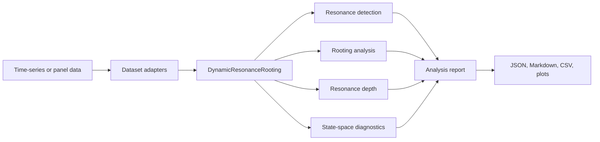
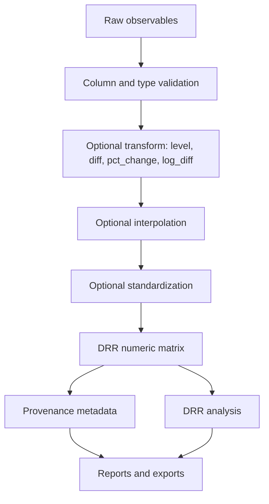
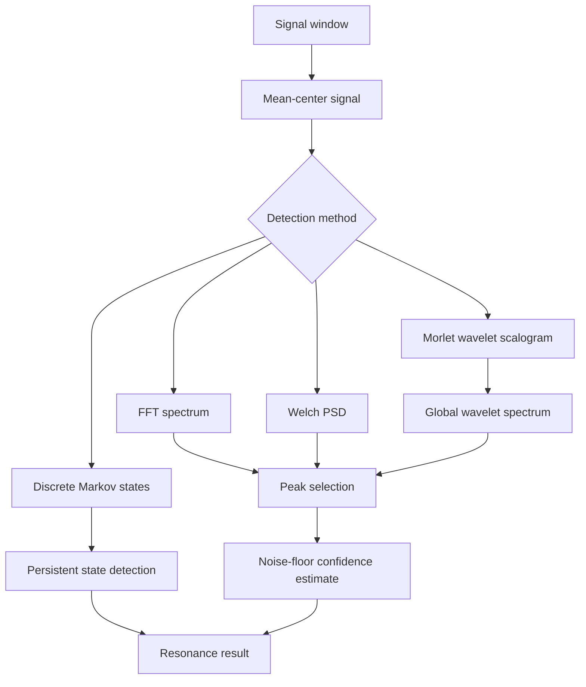
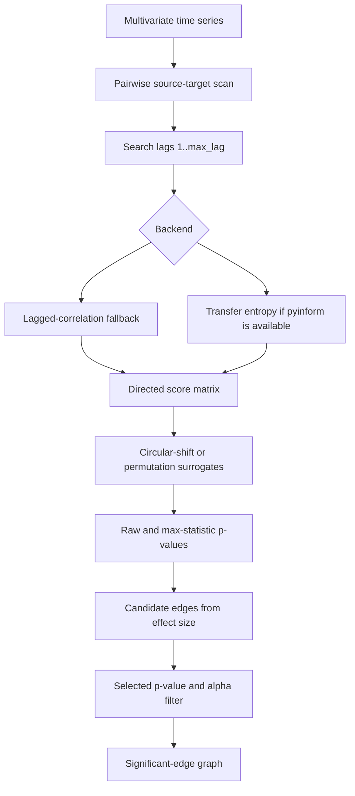
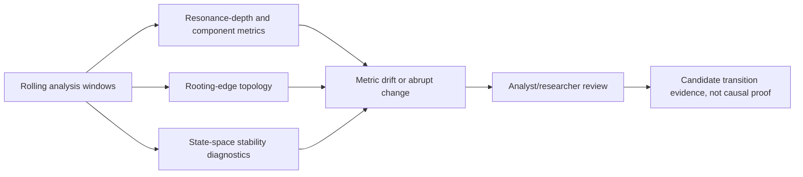
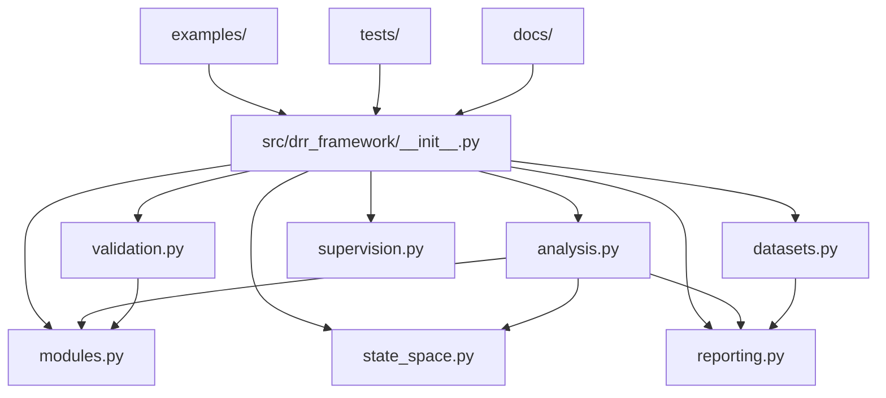

# Architecture

Dynamic Resonance Rooting (DRR) is organized as a research pipeline: prepare a
time-indexed signal matrix, detect resonance structure, estimate directional
rooting relationships, compute resonance-depth metrics, attach state-space and
validation-readiness diagnostics, and export reviewer-readable artifacts.

## Overall DRR Workflow

```mermaid
flowchart LR
    A[Time-series or panel data] --> B[Dataset adapters]
    B --> C[DynamicResonanceRooting]
    C --> D[Resonance detection]
    C --> E[Rooting analysis]
    C --> F[Resonance depth]
    C --> G[State-space diagnostics]
    D --> H[Analysis report]
    E --> H
    F --> H
    G --> H
    H --> I[JSON, Markdown, CSV, plots]
```

## Data Pipeline

```mermaid
flowchart TD
    Raw[Raw observables] --> Validate[Column and type validation]
    Validate --> Transform[Optional transform: level, diff, pct_change, log_diff]
    Transform --> Impute[Optional interpolation]
    Impute --> Standardize[Optional standardization]
    Standardize --> Matrix[DRR numeric matrix]
    Matrix --> Metadata[Provenance metadata]
    Matrix --> Analysis[DRR analysis]
    Metadata --> Reports[Reports and exports]
    Analysis --> Reports
```

## Resonance Detection Process

```mermaid
flowchart TD
    Signal[Signal window] --> Center[Mean-center signal]
    Center --> Method{Detection method}
    Method --> FFT[FFT spectrum]
    Method --> Welch[Welch PSD]
    Method --> Wavelet[Morlet wavelet scalogram]
    Method --> Markov[Discrete Markov states]
    FFT --> Peaks[Peak selection]
    Welch --> Peaks
    Wavelet --> Global[Global wavelet spectrum]
    Global --> Peaks
    Markov --> Persistent[Persistent state detection]
    Peaks --> Confidence[Noise-floor confidence estimate]
    Persistent --> Result[Resonance result]
    Confidence --> Result
```

## Rooting Analysis

```mermaid
flowchart TD
    Matrix[Multivariate time series] --> Pairwise[Pairwise source-target scan]
    Pairwise --> LagSearch[Search lags 1..max_lag]
    LagSearch --> Backend{Backend}
    Backend --> Corr[Lagged-correlation fallback]
    Backend --> TE[Transfer entropy if pyinform is available]
    Corr --> Scores[Directed score matrix]
    TE --> Scores
    Scores --> Surrogates[Circular-shift or permutation surrogates]
    Surrogates --> PValues[Raw and max-statistic p-values]
    PValues --> Candidates[Candidate edges from effect size]
    Candidates --> Threshold[Selected p-value and alpha filter]
    Threshold --> Graph[Significant-edge graph]
```

## Phase Transition Detection

DRR currently exposes phase-transition evidence through changes in resonance
depth, spectral concentration, temporal persistence, rooting-edge structure, and
state-space stability diagnostics. The diagram below describes the intended
review pattern without claiming a validated universal phase-transition detector.

```mermaid
flowchart LR
    Windows[Rolling analysis windows] --> Metrics[Resonance-depth and component metrics]
    Windows --> Roots[Rooting-edge topology]
    Windows --> State[State-space stability diagnostics]
    Metrics --> Drift[Metric drift or abrupt change]
    Roots --> Drift
    State --> Drift
    Drift --> Review[Analyst/researcher review]
    Review --> Caveat[Candidate transition evidence, not causal proof]
```

## Package Architecture

```mermaid
flowchart TD
    API[src/drr_framework/__init__.py] --> Analysis[analysis.py]
    API --> Modules[modules.py]
    API --> Datasets[datasets.py]
    API --> Reporting[reporting.py]
    API --> StateSpace[state_space.py]
    API --> Validation[validation.py]
    API --> Supervision[supervision.py]
    Analysis --> Modules
    Analysis --> StateSpace
    Analysis --> Reporting
    Datasets --> Reporting
    Validation --> Modules
    Examples[examples/] --> API
    Tests[tests/] --> API
    Docs[docs/] --> API
```

## Design Boundaries

- DRR outputs are diagnostics for research and review, not causal proof.
- Transfer entropy is optional; lagged correlation remains the deterministic
  fallback and is reported explicitly.
- The rooting result separates exploratory `candidate_edges` from
  `significant_edges`, and the public graph includes significant edges only.
- Circular-shift surrogates are the default null model. They preserve each
  series' marginal distribution and cyclic ordering, and they approximately
  preserve within-series dependence for reasonably stationary series. They are
  not a good fit for strongly nonstationary series.
- State-space diagnostics are Python-native and inspired by modeling discipline,
  not a copy of external DSGE implementations.
- Supervisory workflows are validation-ready artifacts, not validated
  supervisory methodology.

## Analysis and visualization

The numerical workflow lives in `analysis.py`, composed from resonance detection,
rooting, depth calculation, and state-space modules. Rendering belongs in
`visualizations.py` and consumes results and explicit plotting context; it must
not import or mutate the analysis object.

`DynamicResonanceRooting.plot_results(results, data, save_plots=False, show=True)`
remains the compatibility entry point. It loads the renderer only when requested.
The renderer receives sampling rate, embedding dimension, time delay, and phase
space explicitly. Numerical analysis therefore does not initialize Matplotlib.
Matplotlib remains an installation dependency; this change isolates its runtime
use without changing package requirements.

The compact `visualizations.plot_results(results, data)` notebook helper retains
its existing behavior. The comprehensive renderer is `plot_analysis_results`.

### Refactoring plan

1. Lock current plotting behavior: panel contents, phase-space fallback, network
   summaries, save filename, display/close semantics, and empty results.
2. Add a subprocess regression that blocks Matplotlib imports and exercises the
   numerical workflow. Confirm that it fails before extraction.
3. Move the comprehensive renderer into the existing visualization module and
   replace the class implementation with a lazy delegation using explicit context.
   Preserve numerical code, plotting calculations, and public method arguments.
4. Run regression and full tests, Ruff, Black, mypy, and source compilation.

This extraction avoids both a new rendering class and a renderer that receives
the entire mutable analysis object. New presentation formats should consume
analysis outputs rather than add presentation dependencies to numerical modules.
